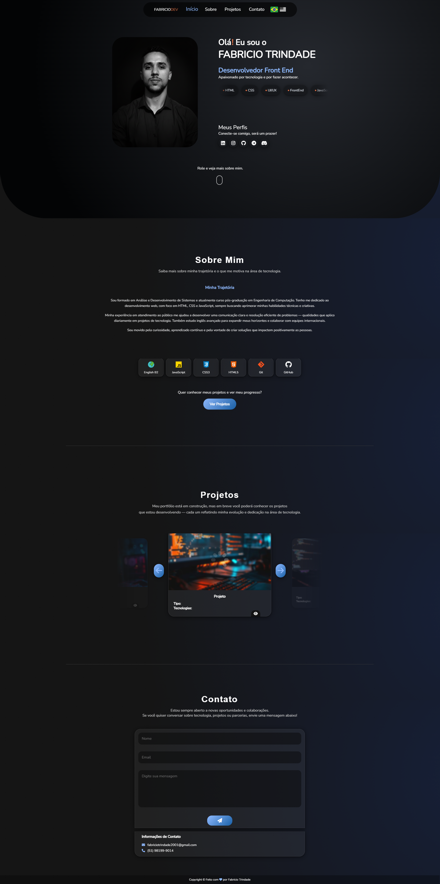

# Meu Portfólio Pessoal

Bem-vindo(a) ao repositório do meu **Website Portfólio**!  

O site foi criado para mostrar minha trajetória profissional, formações e projetos pessoais de forma visual, moderna e responsiva.  

Atualmente está **em desenvolvimento**, mas já apresenta uma versão funcional do portfólio.

---

## Tecnologias utilizadas

- **HTML5**  
- **CSS3** (responsivo e com animações)  
- **JavaScript**  
- **AOS.js** (animações ao rolar a página)  
- **Google Fonts / Icons**  
- **Git** (controle de versão)  
- **Netlify** (hospedagem com domínio próprio)

---

## Funcionalidades atuais

- Apresentação de projetos e experiências  
- Navegação entre seções do portfólio  
- Layout responsivo para desktop e mobile

---

## Melhorias futuras

- Adicionar mais projetos na aba **Projetos**  
- Implementar **formulário de contato funcional** com backend  
- Melhorar interatividade e animações

---

## Como acessar

🔗 **Site online:** [https://fabriciotrindade.com.br](https://fabriciotrindade.com.br)

---

## Preview

